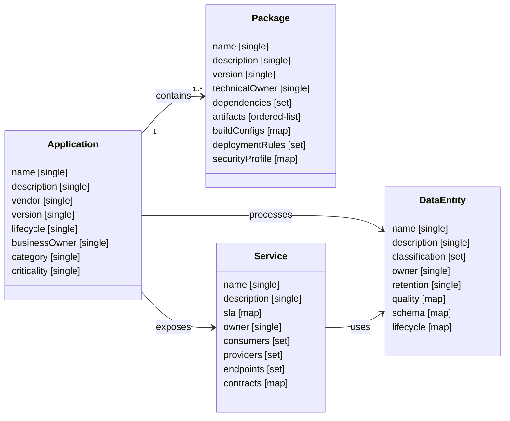

# Application Layer
 Implements business functionality through software

## Relationships

```mermaid

classDiagram
    direction LR
    
    class Application {
        name [single]
        description [single]
        vendor [single]
        version [single]
        lifecycle [single]
        businessOwner [single]
        category [single]
        criticality [single]
    }

    class Package {
        name [single]
        description [single]
        version [single]
        technicalOwner [single]
        dependencies [set]
        artifacts [ordered-list]
        buildConfigs [map]
        deploymentRules [set]
        securityProfile [map]
    }

    class Service {
        name [single]
        description [single]
        sla [map]
        owner [single]
        consumers [set]
        providers [set]
        endpoints [set]
        contracts [map]
    }

    class DataEntity {
        name [single]
        description [single]
        classification [set]
        owner [single]
        retention [single]
        quality [map]
        schema [map]
        lifecycle [map]
    }

    

    %% Internal Relationships
    Application "1" --> "1..*" Package : contains
    Application --> Service : exposes
    Application --> DataEntity : processes
    Service --> DataEntity : uses

    %% External Interface points
    %%Application --> "Business Layer" : supports
    %%Package --> "Technology Layer" : runs on
    %%DataEntity --> "Risk Layer" : subject to
```