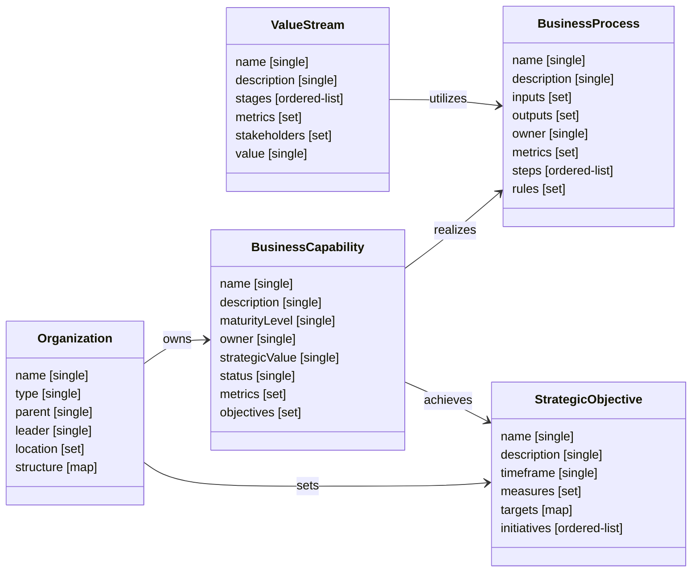

# Business Architecture Layer
 Defines capabilities, processes, and value creation
 
## Relationships

```mermaid
classDiagram
    direction LR
    
    class Organization {
        name [single]
        type [single]
        parent [single]
        leader [single]
        location [set]
        structure [map]
    }

    class StrategicObjective {
        name [single]
        description [single]
        timeframe [single]
        measures [set]
        targets [map]
        initiatives [ordered-list]
    }

    class ValueStream {
        name [single]
        description [single]
        stages [ordered-list]
        metrics [set]
        stakeholders [set]
        value [single]
    }

    class BusinessCapability {
        name [single]
        description [single]
        maturityLevel [single]
        owner [single]
        strategicValue [single]
        status [single]
        metrics [set]
        objectives [set]
    }

    class BusinessProcess {
        name [single]
        description [single]
        inputs [set]
        outputs [set]
        owner [single]
        metrics [set]
        steps [ordered-list]
        rules [set]
    }


    %% Internal Relationships
    BusinessCapability --> BusinessProcess : realizes
    ValueStream --> BusinessProcess : utilizes
    Organization --> BusinessCapability : owns
    BusinessCapability --> StrategicObjective : achieves
    Organization --> StrategicObjective : sets

    %% External Interface points
   %% BusinessProcess --> "Application Layer" : supported by
   %% BusinessCapability --> "Role Layer" : enabled by
   %% BusinessCapability --> "Risk Layer" : threatened by
```