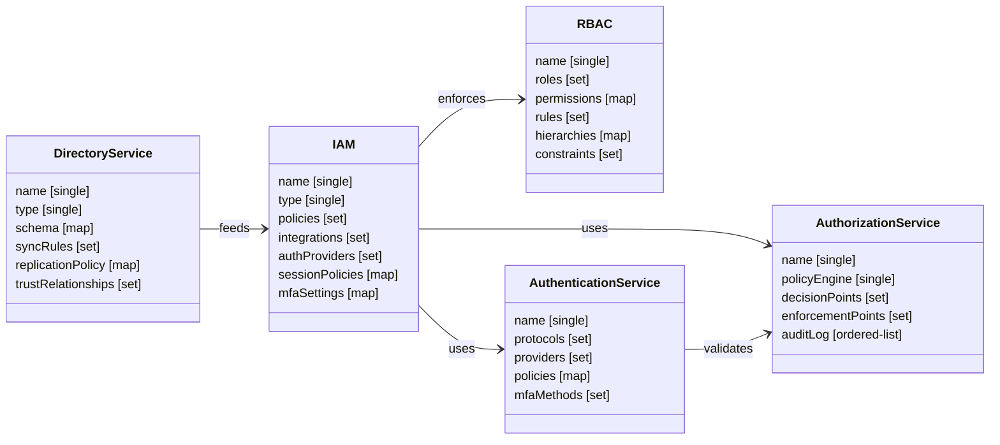

# Identity & Access Layer
 Manages authentication, authorization, and access control
## Relationships

```mermaid
classDiagram
    direction LR
    
    %% Core Identity Classes
    class DirectoryService {
        name [single]
        type [single]
        schema [map]
        syncRules [set]
        replicationPolicy [map]
        trustRelationships [set]
    }

    class IAM {
        name [single]
        type [single]
        policies [set]
        integrations [set]
        authProviders [set]
        sessionPolicies [map]
        mfaSettings [map]
    }

    class RBAC {
        name [single]
        roles [set]
        permissions [map]
        rules [set]
        hierarchies [map]
        constraints [set]
    }

    class AuthenticationService {
        name [single]
        protocols [set]
        providers [set]
        policies [map]
        mfaMethods [set]
    }

    class AuthorizationService {
        name [single]
        policyEngine [single]
        decisionPoints [set]
        enforcementPoints [set]
        auditLog [ordered-list]
    }

    %% Identity Relationships
    DirectoryService --> IAM : feeds
    IAM --> AuthenticationService : uses
    IAM --> AuthorizationService : uses
    IAM --> RBAC : enforces
    AuthenticationService --> AuthorizationService : validates

    %% External Interface points
 %%   RBAC --> "Role Layer" : implements
 %%   AuthorizationService --> "Technology Layer" : protects
```