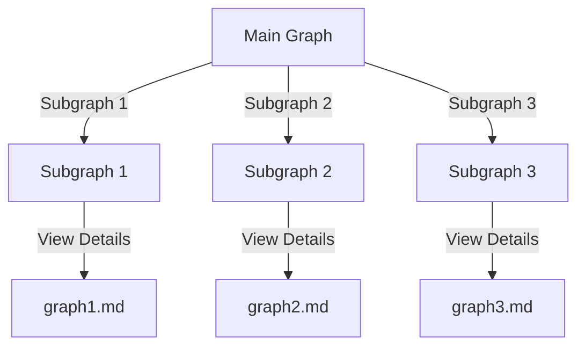

# Graph Visualization

This repository contains an interactive graph with three subgraphs. Click on each subgraph to view its details.

## Subgraph Details

- [Subgraph 1](graph1.md)
- [Subgraph 2](graph2.md)
- [Subgraph 3](graph3.md)
