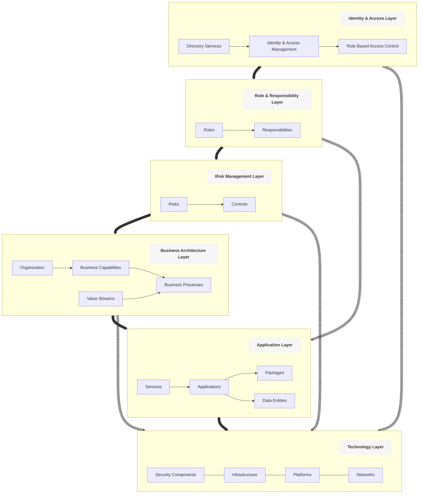

# Enterprise Architecture

```mermaid
graph TB
    %% Layer Definitions
    subgraph Identity[" "]
        IdentityLink["<b>Identity & Access Layer<b>"]
        direction LR
        DS[Directory Services]
        IAM[Identity & Access Management]
        RBAC[Role Based Access Control]
        DS --> IAM --> RBAC
    end

    subgraph RoleResp[" "]
        RoleRespLink["<b>Role & Responsibility Layer<b>"]
        direction LR
        ROLE[Roles]
        RESP[Responsibilities]
        ROLE --> RESP
    end

    subgraph RiskMgmt[" "]
        RiskMgmtLink["<b>Risk Management Layer<b>"]
        direction LR
        RISK[Risks]
        CTRL[Controls]
        RISK --> CTRL
    end

    subgraph Business[" "]
        BusinessLink["<b>Business Architecture Layer<b>"]
        direction LR
        CAP[Business Capabilities]
        PROC[Business Processes]
        VS[Value Streams]
        ORG[Organization]
        CAP --> PROC
        VS --> PROC
        ORG --> CAP
    end

    subgraph Application[" "]
        ApplicationLink["<b>Application Layer<b>"]
        direction LR
        APP[Applications]
        PKG[Packages]
        SVC[Services]
        DATA[Data Entities]
        APP --> PKG
        SVC --> APP
        APP --> DATA
    end

    subgraph Technology[" "]
        TechnologyLink["<b>Technology Layer<b>"]
        direction LR
        INFRA[Infrastructure]
        PLATFORM[Platforms]
        NETWORK[Networks]
        SEC[Security Components]
        INFRA --- PLATFORM
        PLATFORM --- NETWORK
        SEC --- INFRA
    end

    %% Inter-Layer Relationships
    Identity --> RoleResp
    linkStyle 13 stroke-width:10px;
    RoleResp --> RiskMgmt
    linkStyle 14 stroke-width:10px;
    RiskMgmt --> Business
    linkStyle 15 stroke-width:10px;
    Business --> Application
    linkStyle 16 stroke-width:10px;
    Application --> Technology
    linkStyle 17 stroke-width:10px;

    %% Cross-Cutting Relationships
    RoleResp -.-> Application
    linkStyle 18 stroke-width:10px;
    RiskMgmt -.-> Technology
    linkStyle 19 stroke-width:10px;
    Identity -.-> Technology
    linkStyle 20 stroke-width:10px;
    Business -.-> Technology
    linkStyle 21 stroke-width:10px;

classDef linkNode fill:#f6f6f6,stroke-width:0,font-weight:bold,text-align:center
class IdentityLink,RoleRespLink,RiskMgmtLink,BusinessLink,ApplicationLink,TechnologyLink linkNode
    click IdentityLink "../Identity.md" _blank
    click RoleRespLink "../RoleResp.md" _blank
    click RiskMgmtLink "../RiskMgmt.md" _blank
    click BusinessLink "../Business.md" _blank
    click ApplicationLink "../Application.md" _blank
    click TechnologyLink "../Technology.md" _blank

    %% Layer Descriptions
    %% Identity & Access Layer: Manages authentication, authorization, and access control
    %% Role & Responsibility Layer: Defines who can do what and who is accountable
    %% Risk Management Layer: Identifies, assesses, and controls risks
    %% Business Architecture Layer: Defines capabilities, processes, and value creation
    %% Application Layer: Implements business functionality through software
    %% Technology Layer: Provides infrastructure and platform services

    %% Key Relationships
    %% Solid lines: Direct hierarchical relationships
    %% Dotted lines: Cross-cutting concerns and dependencies
```
