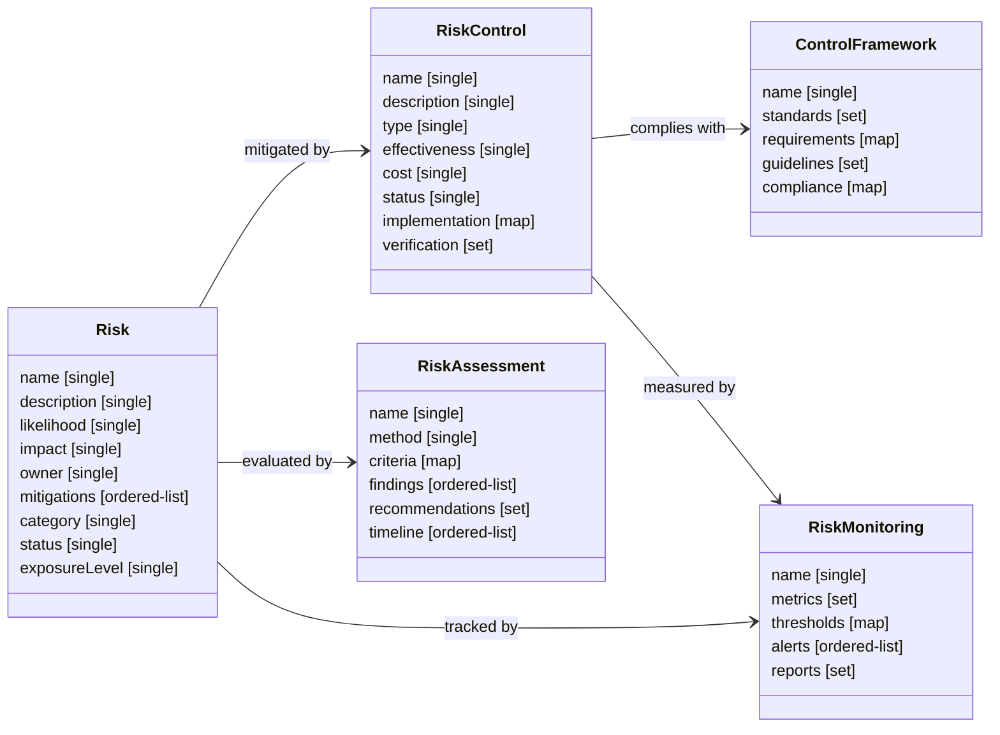

# Risk Management Layer
 Identifies, assesses, and controls risks
## Relationships

```mermaid
classDiagram
    direction LR
    
    class Risk {
        name [single]
        description [single]
        likelihood [single]
        impact [single]
        owner [single]
        mitigations [ordered-list]
        category [single]
        status [single]
        exposureLevel [single]
    }

    class RiskControl {
        name [single]
        description [single]
        type [single]
        effectiveness [single]
        cost [single]
        status [single]
        implementation [map]
        verification [set]
    }

    class RiskAssessment {
        name [single]
        method [single]
        criteria [map]
        findings [ordered-list]
        recommendations [set]
        timeline [ordered-list]
    }

    class ControlFramework {
        name [single]
        standards [set]
        requirements [map]
        guidelines [set]
        compliance [map]
    }

    class RiskMonitoring {
        name [single]
        metrics [set]
        thresholds [map]
        alerts [ordered-list]
        reports [set]
    }

    %% Internal Relationships
    Risk --> RiskControl : mitigated by
    Risk --> RiskAssessment : evaluated by
    RiskControl --> ControlFramework : complies with
    Risk --> RiskMonitoring : tracked by
    RiskControl --> RiskMonitoring : measured by

    %% External Interface points
  %%  Risk --> "Responsibility Layer" : assigned to
  %%  Risk --> "Business Layer" : threatens
  %%  RiskControl --> "Technology Layer" : implemented in
```