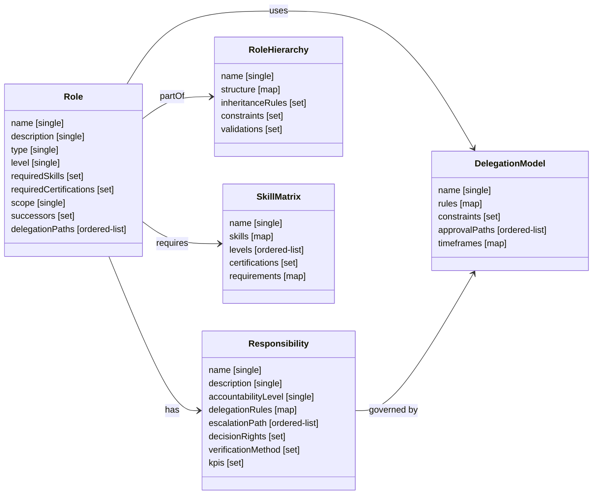

# Role & Responsibility Layer
 Defines who can do what and who is accountable
# Relationships

```mermaid
classDiagram
    direction LR
    
    class Role {
        name [single]
        description [single]
        type [single]
        level [single]
        requiredSkills [set]
        requiredCertifications [set]
        scope [single]
        successors [set]
        delegationPaths [ordered-list]
    }

    class Responsibility {
        name [single]
        description [single]
        accountabilityLevel [single]
        delegationRules [map]
        escalationPath [ordered-list]
        decisionRights [set]
        verificationMethod [set]
        kpis [set]
    }

    class RoleHierarchy {
        name [single]
        structure [map]
        inheritanceRules [set]
        constraints [set]
        validations [set]
    }

    class SkillMatrix {
        name [single]
        skills [map]
        levels [ordered-list]
        certifications [set]
        requirements [map]
    }

    class DelegationModel {
        name [single]
        rules [map]
        constraints [set]
        approvalPaths [ordered-list]
        timeframes [map]
    }

    %% Internal Relationships
    Role --> Responsibility : has
    Role --> RoleHierarchy : partOf
    Role --> SkillMatrix : requires
    Role --> DelegationModel : uses
    Responsibility --> DelegationModel : governed by

    %% External Interface points
  %%  Role --> "RBAC Layer" : implemented by
  %%  Role --> "Risk Layer" : manages
  %%  Role --> "Business Layer" : enables
```