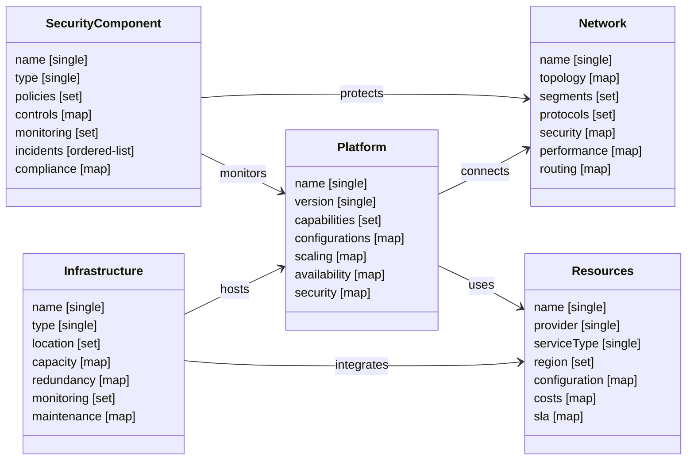

# Technology Layer
 Provides infrastructure and platform services
# Relationships

```mermaid
classDiagram
    direction LR
    
    class Infrastructure {
        name [single]
        type [single]
        location [set]
        capacity [map]
        redundancy [map]
        monitoring [set]
        maintenance [map]
    }

    class Platform {
        name [single]
        version [single]
        capabilities [set]
        configurations [map]
        scaling [map]
        availability [map]
        security [map]
    }

    class Network {
        name [single]
        topology [map]
        segments [set]
        protocols [set]
        security [map]
        performance [map]
        routing [map]
    }

    class SecurityComponent {
        name [single]
        type [single]
        policies [set]
        controls [map]
        monitoring [set]
        incidents [ordered-list]
        compliance [map]
    }

    class Resources {
        name [single]
        provider [single]
        serviceType [single]
        region [set]
        configuration [map]
        costs [map]
        sla [map]
    }

    %% Internal Relationships
    Infrastructure --> Platform : hosts
    Platform --> Network : connects
    SecurityComponent --> Network : protects
    SecurityComponent --> Platform : monitors
    Infrastructure --> Resources : integrates
    Platform --> Resources : uses

    %% External Interface points
  %%  Platform --> "Application Layer" : supports
  %%  SecurityComponent --> "Risk Layer" : implements
  %%  Infrastructure --> "Business Layer" : enables
```