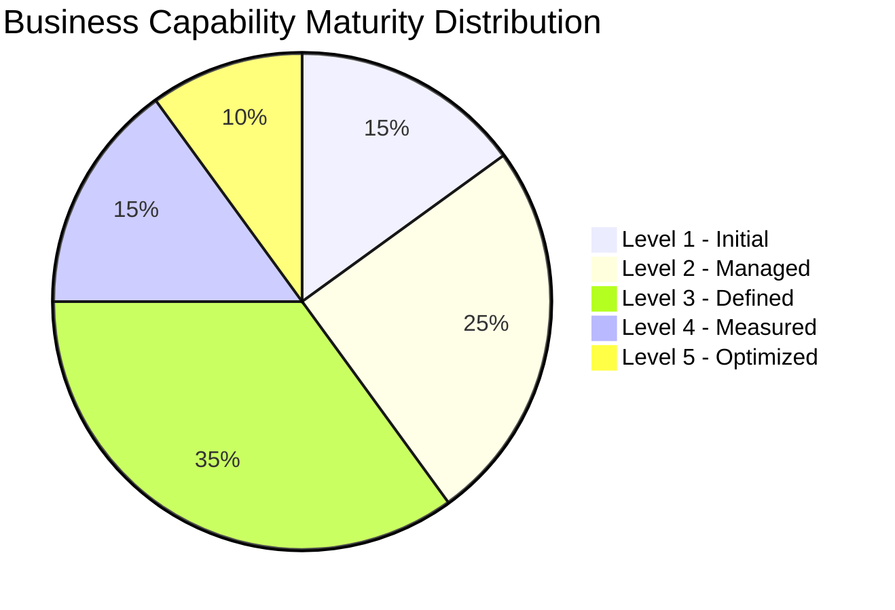
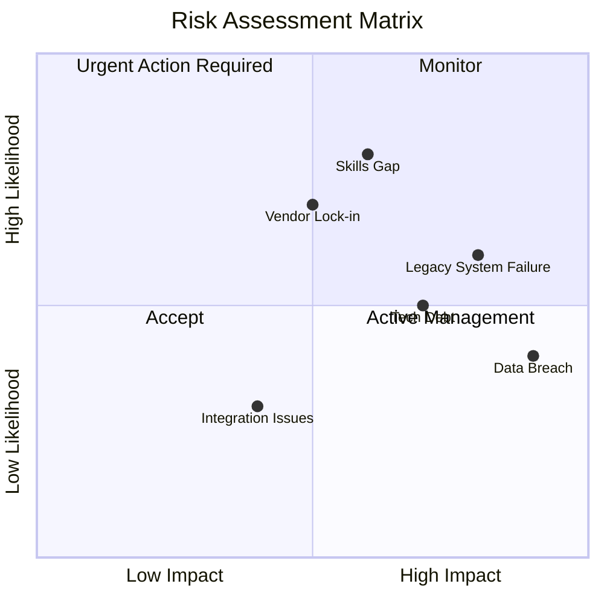
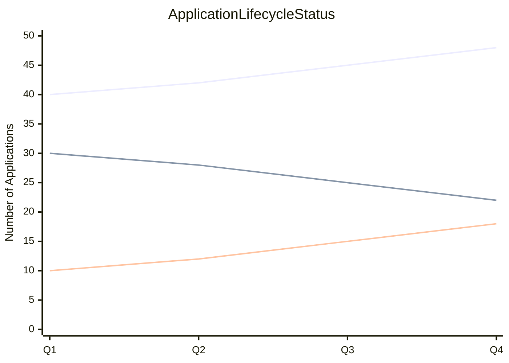
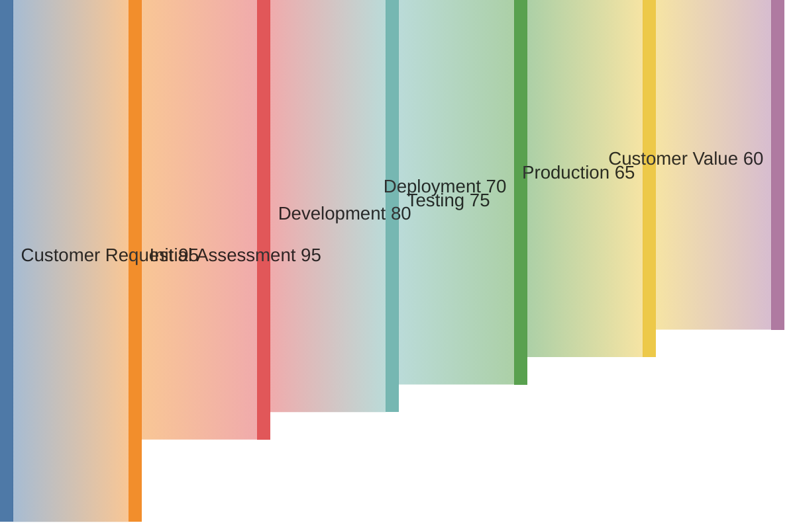
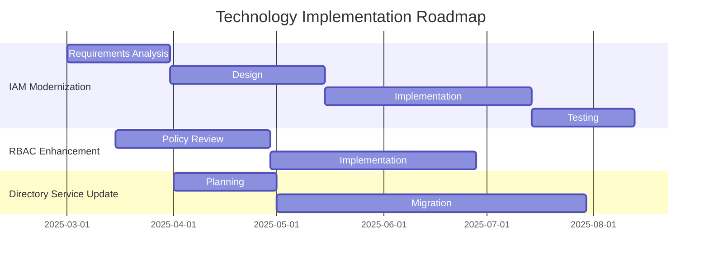

# Enterprise Architecture Dashboards

## 1. Strategic Capability Dashboard

### Purpose and Value
- Provides strategic overview of organizational capability maturity
- Identifies gaps in capability development
- Supports investment decision-making
- Enables tracking of capability improvement initiatives
- Helps prioritize transformation efforts

### Data Sources
From BusinessCapability class:
- maturityLevel [single]
- strategicValue [single]
- status [single]
- businessDrivers [set]

Additional context from:
- Organization.owner relationship to BusinessCapability
- Role relationship "enables" to BusinessCapability

### Key Visualizations

## 2. Risk Management Dashboard

### Purpose and Value
- Visualizes enterprise risk landscape
- Prioritizes risk mitigation efforts
- Tracks effectiveness of control measures
- Supports resource allocation for risk management
- Enables proactive risk management

### Data Sources
From Risk class:
- likelihood [single]
- impact [single]
- mitigations [ordered-list]
- owner [single]

From RiskControl class:
- effectiveness [single]
- cost [single]
- status [single]

Relationships:
- Risk "threatens" BusinessCapability
- Risk "impacts" Application
- Risk "affects" Technology
- Risk "endangers" DataEntity

### Key Visualizations

## 3. Application Portfolio Dashboard

### Purpose and Value
- Tracks application lifecycle status
- Identifies modernization opportunities
- Manages technical debt
- Plans application retirement
- Optimizes application investments

### Data Sources
From Application class:
- lifecycle [single]
- version [single]
- businessOwner [single]

From Package class:
- dependencies [set]
- securityProfile [map]
- buildConfigs [map]

Additional context:
- Application "supported by" BusinessProcess
- Role "uses" Application relationship

### Key Visualizations

## 4. Value Stream Performance Dashboard

### Purpose and Value
- Measures end-to-end value delivery
- Identifies process bottlenecks
- Tracks value stream efficiency
- Supports continuous improvement
- Aligns capabilities with value delivery

### Data Sources
From ValueStream class:
- metrics [set]
- stages [ordered-list]
- value [single]
- stakeholders [set]

From ValueStage class:
- duration [single]
- efficiency [single]
- inputs [set]
- outputs [set]

Related data:
- ValueStream "requires" BusinessCapability
- ValueStage "utilizes" BusinessProcess

### Key Visualizations

## 5. Technology Implementation Dashboard

### Purpose and Value
- Tracks implementation timelines
- Manages project dependencies
- Coordinates technology rollouts
- Supports resource planning
- Monitors implementation progress

### Data Sources
From Technology class:
- lifecycle [single]
- version [single]
- support [map]

From Package class:
- deploymentRules [set]
- buildConfigs [map]

Integration data from:
- IAM "enforces" RBAC
- DirectoryService "feeds" IAM
- Package "runs on" Technology

### Key Visualizations

## 6. Heatmap Visualizations

```mermaid

block-beta
    columns 5
    01[" "] 02[" "] 03[" "] 04[" "] 05[" "]
    06[" "] 07[" "] 08[" "] 09[" "] 10[" "]
    11[" "] 12[" "] 13[" "] 14[" "] 15[" "]
    16[" "] 17[" "] 18[" "] 19[" "] 20[" "]
    
    %% Light Red
    style 01 fill:#FF6666,stroke:0,stroke-width:0px
    %% Lighter Red
    style 02 fill:#FF7777,stroke:0,stroke-width:0px
    %% Pale Red
    style 03 fill:#FF8888,stroke:0,stroke-width:0px
    %% Very Pale Red
    style 04 fill:#FF9999,stroke:0,stroke-width:0px
    %% Bright Red
    style 05 fill:#FF0000,stroke:0,stroke-width:0px
    %% Very Pale Red
    style 06 fill:#FF9999,stroke:0,stroke-width:0px
    %% Tan Orange
    style 07 fill:#E6C5A3,stroke:0,stroke-width:0px
    %% Tan Orange
    style 08 fill:#E6C5A3,stroke:0,stroke-width:0px
    %% Tan Orange
    style 09 fill:#E6C5A3,stroke:0,stroke-width:0px
    %% Tan Orange
    style 10 fill:#E6C5A3,stroke:0,stroke-width:0px
    %% Pale Green
    style 11 fill:#B8E0A1,stroke:0,stroke-width:0px
    %% Sage Green
    style 12 fill:#D4D4A2,stroke:0,stroke-width:0px
    %% Sage Green
    style 13 fill:#D4D4A2,stroke:0,stroke-width:0px
    %% Sage Green
    style 14 fill:#D4D4A2,stroke:0,stroke-width:0px
    %% Sage Green
    style 15 fill:#D4D4A2,stroke:0,stroke-width:0px
    %% Light Green
    style 16 fill:#90EE90,stroke:0,stroke-width:0px
    %% Pale Green
    style 17 fill:#B8E0A1,stroke:0,stroke-width:0px
    %% Pale Green
    style 18 fill:#B8E0A1,stroke:0,stroke-width:0px
    %% Pale Green
    style 19 fill:#B8E0A1,stroke:0,stroke-width:0px
    %% Pale Green
    style 20 fill:#B8E0A1,stroke:0,stroke-width:0px
```

## Data Refresh Considerations

For all dashboards:
- Business Capability and Value Stream metrics should be updated quarterly
- Risk assessments should be reviewed monthly
- Application and Technology status should be updated weekly
- Implementation progress should be tracked daily
- All metrics should be versioned to enable trend analysis
- Data quality should be validated through automated checks
- Manual review processes should be established for critical metrics
- Automated data collection should be implemented where possible
- Change logs should be maintained for audit purpose