# Enterprise Architecture Dashboards

## 1. Risk Exposure Dashboard

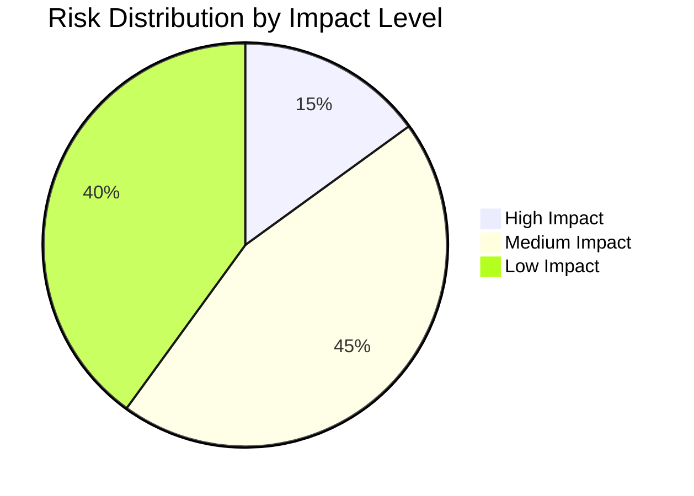
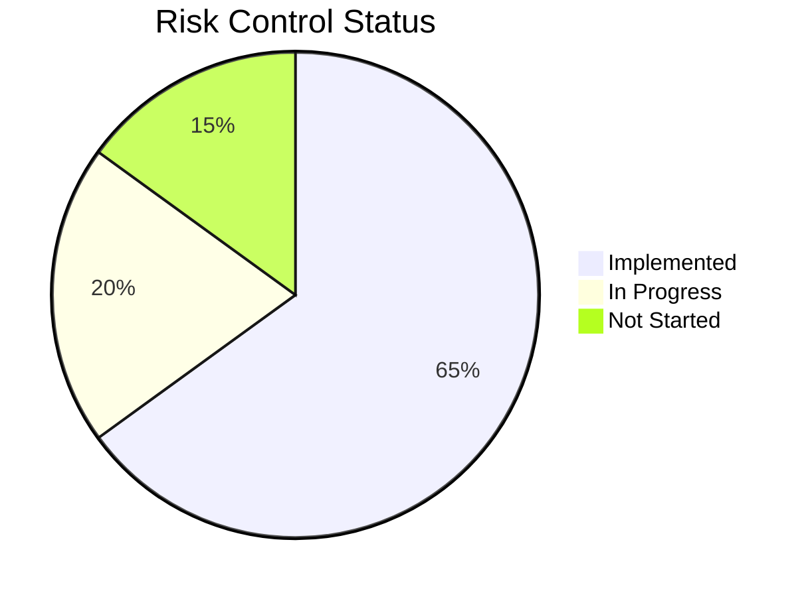

### Data Sources and Interpretation

This dashboard visualizes [Risk](ea-glossary.md#risk) distribution across the enterprise. The data is sourced from:

- **Risk Impact Distribution**:
  - Derived from the `impact` attribute of [Risk](ea-glossary.md#risk) entities
  - Categorized by impact levels defined in `likelihood` and `impact` attributes
  - Links to affected [BusinessCapability](ea-glossary.md#business-capability) entities through the "threatens" relationship

- **Risk Control Status**:
  - Based on [RiskControl](ea-glossary.md#risk-control) entities
  - Tracks `effectiveness` and `status` attributes
  - Maps to `mitigations` attribute in [Risk](ea-glossary.md#risk) entities

## 2. System Lifecycle Timeline

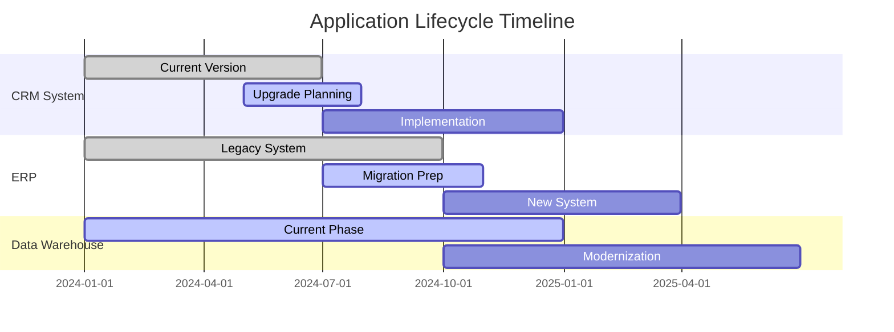

### Data Sources and Interpretation

This timeline tracks the lifecycle of key [Application](ea-glossary.md#application) entities. Data is sourced from:

- **Application Status**:
  - `lifecycle` attribute of [Application](ea-glossary.md#application) entities
  - `version` tracking from [Package](ea-glossary.md#package) entities
  - `deploymentRules` from associated [Package](ea-glossary.md#package) entities

- **Technology Stack**:
  - [Technology](ea-glossary.md#technology) entities supporting each application
  - `vendor` and `version` attributes
  - `lifecycle` status of underlying technologies

## 3. Business Capability Maturity

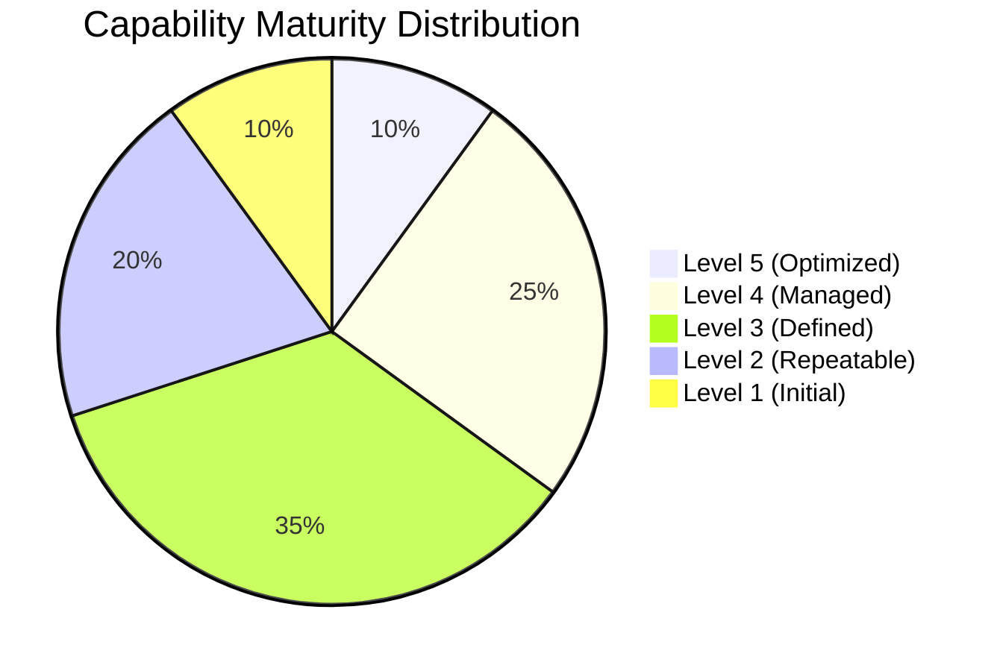
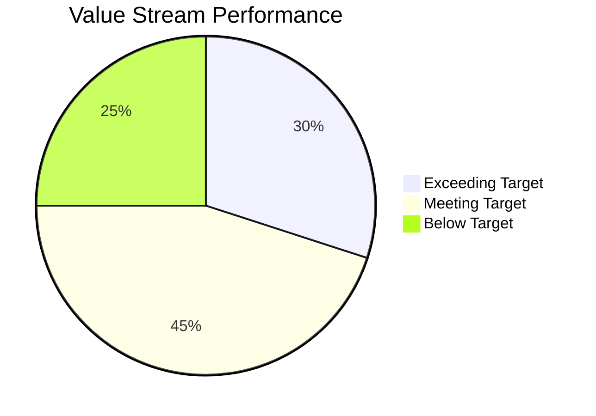

### Data Sources and Interpretation

This dashboard visualizes the maturity of [BusinessCapability](ea-glossary.md#business-capability) entities and their associated [ValueStream](ea-glossary.md#value-stream) performance:

- **Capability Maturity**:
  - Based on `maturityLevel` attribute of [BusinessCapability](ea-glossary.md#business-capability) entities
  - Influenced by `strategicValue` assessment
  - Connected to `businessDrivers` showing strategic alignment

- **Value Stream Performance**:
  - Derived from `metrics` in [ValueStream](ea-glossary.md#value-stream) entities
  - Performance of associated [ValueStage](ea-glossary.md#value-stage) entities
  - Tracks `efficiency` and `effectiveness` metrics

## 4. Technology Modernization Timeline

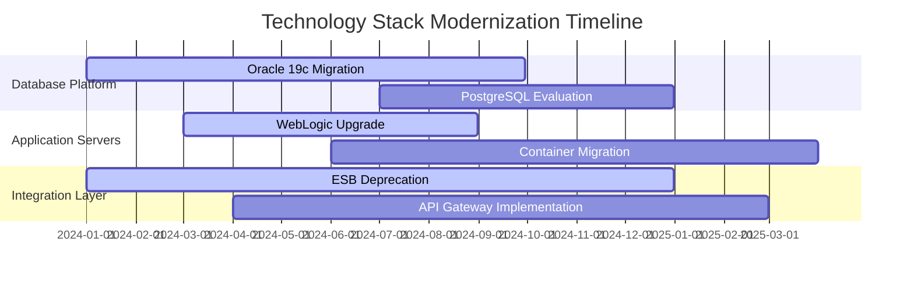

### Data Sources and Interpretation

This timeline tracks the modernization of [Technology](ea-glossary.md#technology) components:

- **Platform Updates**:
  - Tracks `lifecycle` stages of [Technology](ea-glossary.md#technology) entities
  - Maps to `dependencies` in [Package](ea-glossary.md#package) entities
  - Considers `support` arrangements and vendor relationships

- **Integration Evolution**:
  - Based on [Service](ea-glossary.md#service) implementation changes
  - Tracks `sla` requirements and performance
  - Maps to [Application](ea-glossary.md#application) integration points

## Dashboard Update Frequency

- **Real-time Updates**:
  - Risk metrics from [Risk](ea-glossary.md#risk) and [RiskControl](ea-glossary.md#risk-control) entities
  - [Application](ea-glossary.md#application) status changes
  - [Service](ea-glossary.md#service) performance metrics

- **Weekly Updates**:
  - [Technology](ea-glossary.md#technology) lifecycle status
  - [Package](ea-glossary.md#package) deployment status
  - Integration health metrics

- **Monthly Updates**:
  - [BusinessCapability](ea-glossary.md#business-capability) maturity assessments
  - [ValueStream](ea-glossary.md#value-stream) performance metrics
  - Strategic alignment measures

## 5. EA Health Dashboard

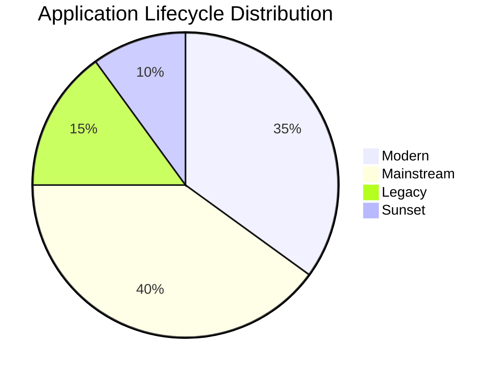
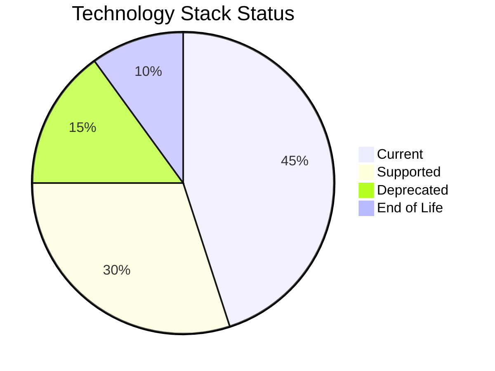

### Data Sources and Interpretation

This dashboard provides a comprehensive view of enterprise architecture health metrics:

- **Application Portfolio Health**:
  - Derived from [Application](ea-glossary.md#application) entities' `lifecycle` attribute
  - Tracks `version` status across [Package](ea-glossary.md#package) entities
  - Maps to [Technology](ea-glossary.md#technology) dependencies

- **Business Architecture Status**:
  - [BusinessCapability](ea-glossary.md#business-capability) `maturityLevel` distribution
  - [ValueStream](ea-glossary.md#value-stream) efficiency metrics
  - Critical [Risk](ea-glossary.md#risk) exposure and mitigation status

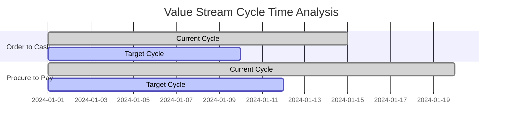

## 6. Digital Transformation Progress Dashboard

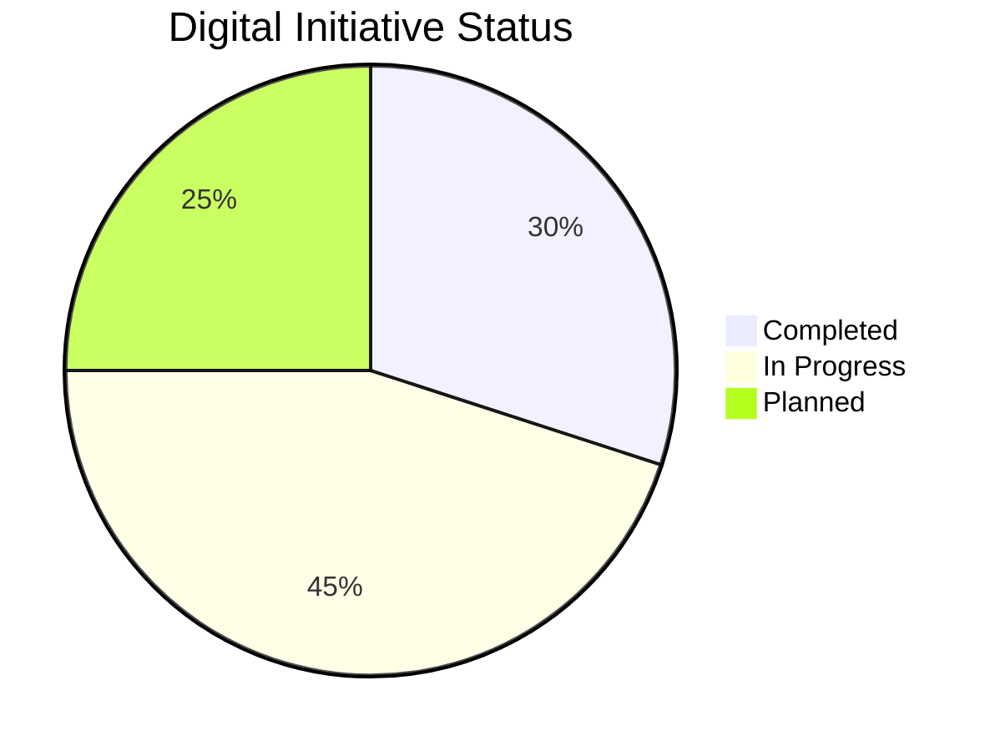
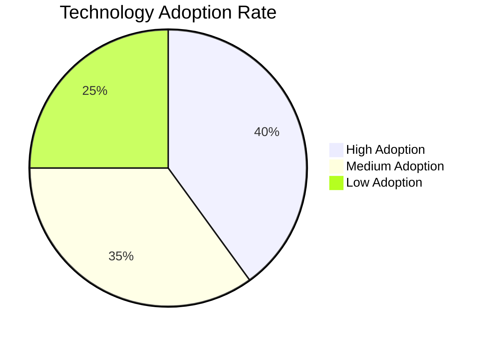

### Data Sources and Interpretation

This dashboard tracks digital transformation progress through:

- **Initiative Tracking**:
  - Maps to [BusinessCapability](ea-glossary.md#business-capability) enhancement projects
  - Tracks [Service](ea-glossary.md#service) modernization efforts
  - Measures adoption of new [Technology](ea-glossary.md#technology) platforms

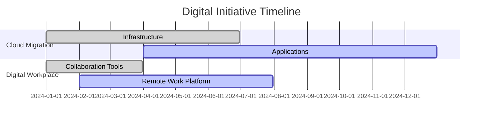

- **Value Realization**:
  - Based on [ValueStream](ea-glossary.md#value-stream) `metrics`
  - Customer satisfaction tracking through [Service](ea-glossary.md#service) `sla` metrics
  - Employee feedback on digital tools adoption

## 7. IT Efficiency Dashboard

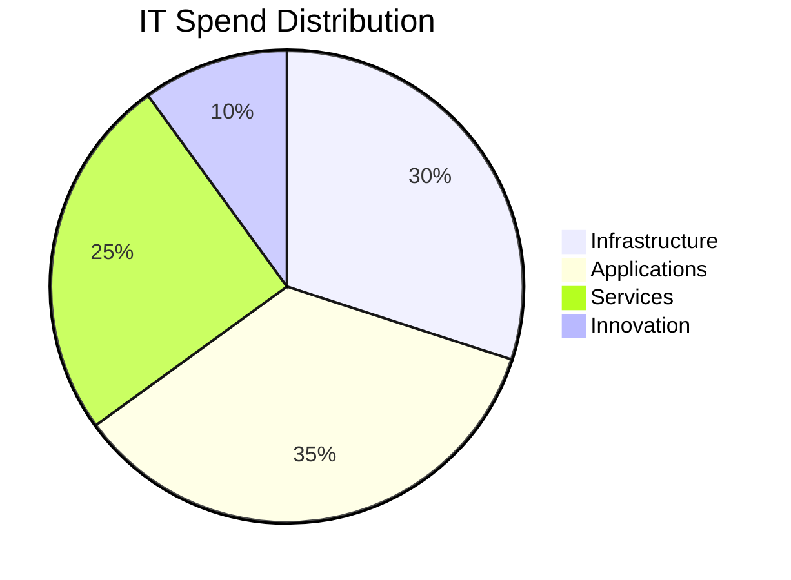
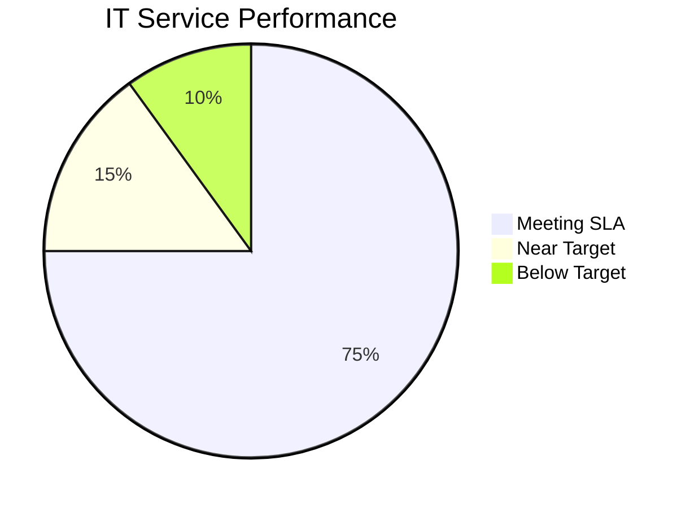

### Data Sources and Interpretation

This dashboard monitors IT operational efficiency through:

- **Resource Utilization**:
  - [Technology](ea-glossary.md#technology) platform usage metrics
  - [Application](ea-glossary.md#application) performance indicators
  - Infrastructure capacity tracking

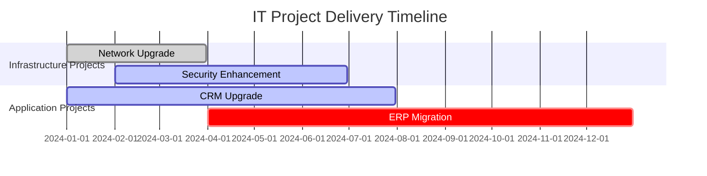

- **Service Performance**:
  - [Service](ea-glossary.md#service) availability metrics from `sla` tracking
  - Incident resolution times from support systems
  - Project delivery metrics against planned timelines

## Data Quality and Governance

All dashboard data is subject to governance through:

- **Ownership**:
  - Clear mapping to `owner` and `businessOwner` attributes
  - [Role](ea-glossary.md#role)-based access through [RBAC](ea-glossary.md#rbac)
  - Defined `accountabilityLevel` for data maintenance

- **Quality Measures**:
  - Data `quality` attributes tracking
  - Regular verification through `verificationMethod`
  - Automated validation through [IAM](ea-glossary.md#iam) systems