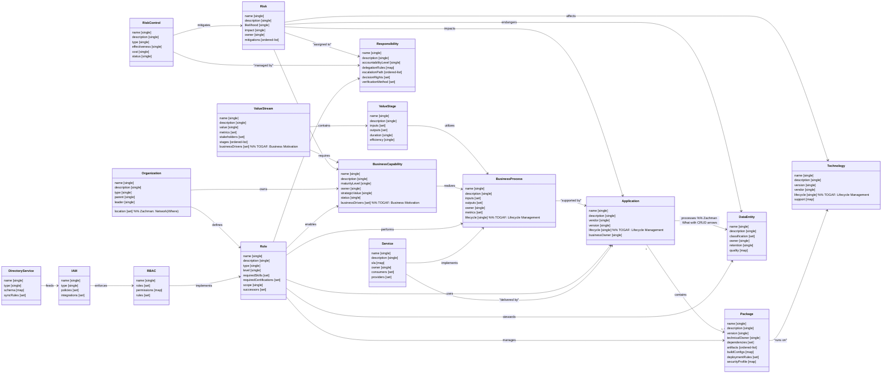

# Enterprise Architecture Diagram

```mermaid
classDiagram
    direction LR
    
    %% Core Enterprise Classes
    %% ---------------------
    
    %% ValueStream Definition:
    %% Represents an end-to-end sequence of activities that creates value for customers or stakeholders.
    %% Serves as a fundamental framework for understanding how value is delivered across the organization.
    class ValueStream {
        name [single]
        description [single]
        value [single]
        metrics [set]
        stakeholders [set]
        stages [ordered-list]
        businessDrivers [set]  %% TOGAF: Business Motivation
    }

    %% ValueStage Definition:
    %% A discrete step or phase within a value stream that transforms specific inputs into outputs.
    %% Each stage contributes to the overall value creation process with measurable metrics.
    class ValueStage {
        name [single]
        description [single]
        inputs [set]
        outputs [set]
        duration [single]
        efficiency [single]
    }

    %% Risk Definition:
    %% A potential event or condition that could negatively impact organizational objectives.
    %% Includes assessment of both probability and impact along with mitigation strategies.
    class Risk {
        name [single]
        description [single]
        likelihood [single]
        impact [single]
        owner [single]
        mitigations [ordered-list]
    }

    %% RiskControl Definition:
    %% A measure or action designed to modify risk through prevention, detection, or mitigation.
    %% Provides specific mechanisms to manage identified risks.
    class RiskControl {
        name [single]
        description [single]
        type [single]
        effectiveness [single]
        cost [single]
        status [single]
    }

    %% BusinessCapability Definition:
    %% A particular ability or capacity that a business requires to achieve its objectives.
    %% Represents what the business can do, independent of organizational structure or processes.
    class BusinessCapability {
        name [single]
        description [single]
        maturityLevel [single]
        owner [single]
        strategicValue [single]
        status [single]
        businessDrivers [set] %% TOGAF: Business Motivation
    }

    %% BusinessProcess Definition:
    %% A collection of related, structured activities that produce a specific service or product.
    %% Describes how work gets done in the organization.
    class BusinessProcess {
        name [single]
        description [single]
        inputs [set]
        outputs [set]
        owner [single]
        metrics [set]
        lifecycle [single] %% TOGAF: Lifecycle Management
    }

    %% Application Definition:
    %% A software system providing specific business functionality to end users.
    %% Represents the technological implementation of business capabilities.
    class Application {
        name [single]
        description [single]
        vendor [single]
        version [single] 
        lifecycle [single] %% TOGAF: Lifecycle Management
        businessOwner [single]
    }

    %% Package Definition:
    %% A deployable component or module of an application with specific functionality.
    %% Represents the smallest deployable unit of software in the architecture.
    class Package {
        name [single]
        description [single]
        version [single]
        technicalOwner [single]
        dependencies [set]
        artifacts [ordered-list]
        buildConfigs [map]
        deploymentRules [set]
        securityProfile [map]
    }

    %% DataEntity Definition:
    %% A logical representation of information that is created, stored, and used by the business.
    %% Defines the structure and characteristics of business information.
    class DataEntity {
        name [single]
        description [single]
        classification [set]
        owner [single]
        retention [single]
        quality [map]
    }

    %% Technology Definition:
    %% Infrastructure and platforms that support applications and data processing.
    %% Represents the technical foundation of the enterprise architecture.
    class Technology {
        name [single]
        description [single]
        version [single]
        vendor [single]
        lifecycle [single] %% TOGAF: Lifecycle Management
        support [map]
    }

    %% Organization Definition:
    %% A structural unit within the enterprise with defined responsibilities.
    %% Represents the organizational context for capabilities and processes.
    class Organization {
        name [single]
        description [single]
        type [single]
        parent [single]
        leader [single]
        location [set] %% Zachman: Network (Where)
    }

    %% Service Definition:
    %% A defined offering that provides value to consumers through specific outcomes.
    %% Represents how capabilities are packaged and delivered to stakeholders.
    class Service {
        name [single]
        description [single]
        sla [map]
        owner [single]
        consumers [set]
        providers [set]
    }

    %% Role Definition:
    %% A defined set of functions and duties assigned to individuals or teams.
    %% Represents who performs work and makes decisions in the organization.
    class Role {
        name [single]
        description [single]
        type [single]
        level [single]
        requiredSkills [set]
        requiredCertifications [set]
        scope [single]
        successors [set]
    }

    %% Responsibility Definition:
    %% A specific duty or obligation assigned to a role.
    %% Defines what a role is accountable for and how it is measured.
    class Responsibility {
        name [single]
        description [single]
        accountabilityLevel [single]
        delegationRules [map]
        escalationPath [ordered-list]
        decisionRights [set]
        verificationMethod [set]
    }

    %% System Components
    %% ----------------

    %% IAM Definition:
    %% Identity and Access Management system controlling authentication and authorization.
    class IAM {
        name [single]
        type [single]
        policies [set]
        integrations [set]
    }

    %% RBAC Definition:
    %% Role-Based Access Control system implementing security policies.
    class RBAC {
        name [single]
        roles [set]
        permissions [map]
        rules [set]
    }

    %% DirectoryService Definition:
    %% Central system managing user identities and organizational structure.
    class DirectoryService {
        name [single]
        type [single]
        schema [map]
        syncRules [set]
    }

    %% Relationships
    %% ------------

    %% Value Stream Relationships
    %% Defines how value flows through the organization
    ValueStream --> ValueStage : contains
    ValueStage --> BusinessProcess : utilizes
    ValueStream --> BusinessCapability : requires

    %% Risk Relationships
    %% Shows how risks impact different architectural elements
    Risk --> BusinessCapability : threatens
    Risk --> Application : impacts
    Risk --> Technology : affects
    Risk --> DataEntity : endangers
    RiskControl --> Risk : mitigates
    Risk --> Responsibility : "assigned to"
    RiskControl --> Responsibility : "managed by"

    %% Business Architecture Relationships
    %% Defines core business structure and operations
    BusinessCapability --> BusinessProcess : realizes
    BusinessProcess --> Application : "supported by"
    Application "1" --> "1..*" Package : contains
    Package --> Technology : "runs on"
    Application --> DataEntity : processes %% Zachman What with CRUD arrows

    %% Organization and Role Relationships
    %% Shows organizational structure and responsibilities
    Organization --> BusinessCapability : owns
    Organization --> Role : defines
    Role --> Responsibility : has
    Role --> BusinessCapability : enables
    Role --> BusinessProcess : performs
    Role --> Application : uses
    Role --> Package : manages
    Role --> DataEntity : stewards

    %% Service Relationships
    %% Defines service implementation and delivery
    Service --> BusinessProcess : implements
    Service --> Application : "delivered by"

    %% System Implementation Relationships
    %% Shows technical system interactions
    IAM --> RBAC : enforces
    RBAC --> Role : implements
    DirectoryService --> IAM : feeds
  
    %% Attribute Types
    %% --------------
    %% single: One value only
    %% set: Collection of unique values, unordered
    %% ordered-list: Sequence of values where order matters
    %% map: Key-value pairs

    %% Attribute Definitions
    %% --------------------
    %% accountabilityLevel [single]: The degree and scope of responsibility for outcomes
    %% artifacts [ordered-list]: Outputs or deliverables produced during development
    %% buildConfigs [map]: Settings and parameters for compilation or assembly
    %% businessOwner [single]: Individual or group responsible for business value and decisions
    %% classification [set]: Security or privacy categorization tags
    %% consumers [set]: Users or systems that utilize the entity
    %% cost [single]: Financial or resource expenditure required
    %% decisionRights [set]: Specific authorities granted for making choices or commitments
    %% delegationRules [map]: Conditions and limits for transferring responsibilities
    %% dependencies [set]: Other entities required for proper functioning
    %% deploymentRules [set]: Specifications for how the entity should be deployed
    %% description [single]: A detailed text explanation of the entity's purpose and scope
    %% duration [single]: Time period required for completion or execution
    %% effectiveness [single]: Degree to which intended results are achieved
    %% efficiency [single]: Measure of resource utilization versus output produced
    %% escalationPath [ordered-list]: Sequence of roles to engage for issue resolution
    %% impact [single]: Magnitude and nature of potential consequences
    %% inputs [set]: Resources or data required for processing or transformation
    %% integrations [set]: Collection of connected systems or interfaces
    %% leader [single]: Individual responsible for direction and decisions
    %% level [single]: Position in the organizational hierarchy
    %% lifecycle [single]: Current phase in the entity's existence from creation to retirement
    %% likelihood [single]: Probability of an event or condition occurring
    %% location [set]: Physical or logical places where the entity exists
    %% maturityLevel [single]: Degree of sophistication or development
    %% metrics [set]: Specific measurements used to assess performance or success
    %% mitigations [ordered-list]: Actions or controls to reduce risk or negative effects
    %% name [single]: A unique identifier string that serves as the primary label for the entity
    %% outputs [set]: Results or products generated from processing or transformation
    %% owner [single]: Individual or group responsible for management and decisions
    %% parent [single]: Higher-level entity in a hierarchical structure
    %% permissions [map]: Access rights and privileges assigned to roles
    %% policies [set]: Rules governing behavior and access
    %% providers [set]: Systems or groups that deliver the entity
    %% quality [map]: Measures of how well the entity meets various requirements
    %% requiredCertifications [set]: Formal qualifications needed for the role
    %% requiredSkills [set]: Capabilities needed to perform the role effectively
    %% retention [single]: Required period for maintaining the entity
    %% roles [set]: Collection of defined functions and responsibilities
    %% rules [set]: Specific constraints or conditions governing behavior
    %% schema [map]: Structure definition for data organization
    %% scope [single]: Boundaries of authority and influence
    %% securityProfile [map]: Security requirements and controls applied to the entity
    %% sla [map]: Service Level Agreement defining performance expectations by metric
    %% stages [ordered-list]: Discrete phases or steps in a sequence of activities
    %% stakeholders [set]: Individuals or groups with interest in or influence over the entity
    %% status [single]: Current state or condition in a lifecycle or process
    %% strategicValue [single]: Importance to achieving organizational objectives
    %% successors [set]: Roles that can assume these responsibilities
    %% support [map]: Maintenance and assistance arrangements by type
    %% syncRules [set]: Rules governing data synchronization
    %% technicalOwner [single]: Individual or group responsible for technical implementation and operation
    %% type [single]: Classification or category of the entity
    %% value [single]: A quantitative or qualitative measure of the worth or importance
    %% vendor [single]: External provider or supplier of the entity
    %% verificationMethod [set]: Ways to confirm responsibility fulfillment
    %% version [single]: Specific iteration or release identifier
```

# Enterprise Architecture Glossary

The [Enterprise Architecture Glossary](ea-glossary.md) contains the definitions used