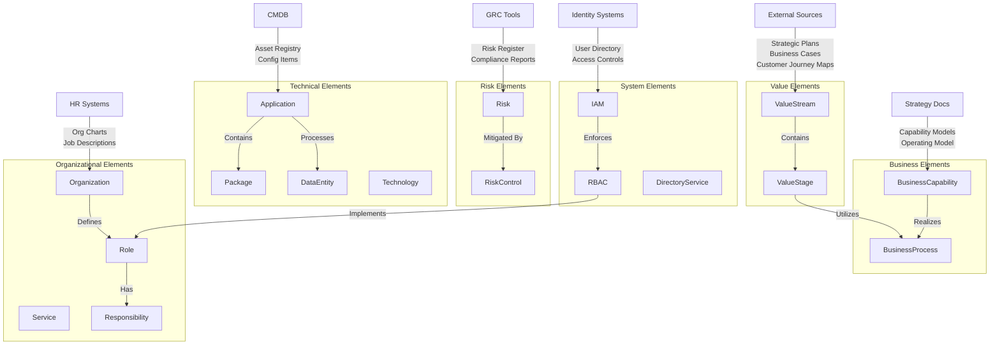

# Enterprise Architecture Population Playbook

## Architecture Overview

## Population Playbook

### 1. Value Stream Layer
**Source Systems**: Strategic Plans, Business Cases, Customer Journey Maps
- Begin with identifying core [Value Streams](#value-stream) from strategic documentation
- Break down each value stream into discrete [Value Stages](#value-stage)
- Document [inputs](#inputs) and [outputs](#outputs), and metrics for each stage
- Ensure value streams align with strategic objectives

**Example Elements**:
- [Value Stream](#value-stream): Customer Onboarding, Product Delivery, Service Fulfillment
- [Value Stage](#value-stage): Application Submission, Verification, Approval, Setup

### 2. Business Layer
**Source Systems**: Strategy Documents, Operating Model, Capability Framework
- Document [Business Capabilities](#business-capability) from strategy documents
- Map capabilities to relevant value streams
- Identify and document [Business Processes](#business-process) that realize capabilities
- Create clear relationships between processes and value stages

**Example Elements**:
- [Business Capability](#business-capability): Payment Processing, Risk Assessment, Customer Service
- [Business Process](#business-process): Account Opening, Credit Evaluation, Service Activation

### 3. Technical Layer
**Source Systems**: CMDB, Application Portfolio
- Extract [Application](#application) inventory from CMDB
- For each application:
  - Document contained [Packages](#package)
  - Map [Data Entities](#data-entity) processed
  - Identify supporting [Technologies](#technology)
  - Link to supported business processes
- Document [integrations](#integrations) points and [dependencies](#dependencies)

**Example Elements**:
- [Applications](#application): CRM System, Payment Gateway, Document Management System
- [Data Entities](#data-entity): Customer Profile, Transaction Record, Product Catalog
- [Technologies](#technology): Database Systems, Integration Platforms, Cloud Services

### 4. Organizational Layer
**Source Systems**: HR Systems, Service Catalog
- Import [Organization](#organization) structure
- Document [Service](#service) offerings
- Define business and technical [Roles](#role)
- Map [Responsibilities](#responsibility) to roles
- Link services to providing organizations

**Example Elements**:
- [Organizations](#organization): IT Operations, Customer Service, Risk Management
- [Roles](#role): System Administrator, Business Analyst, Risk Officer
- [Services](#service): Application Support, Infrastructure Management, Help Desk

### 5. Risk and Control Framework
**Source Systems**: GRC Tools, Risk Register
- Import [Risk](#risk) register
- Document [Risk Control](#risk-control) framework
- Map controls to:
  - Business processes
  - Applications
  - Organizational responsibilities
- Ensure completeness of control coverage

**Example Elements**:
- [Risks](#risk): Data Privacy, System Availability, Regulatory Compliance
- [Controls](#risk-control): Access Management, Change Control, Monitoring Procedures

### 6. Access Management Layer
**Source Systems**: Identity Management Systems, Directory Services
- Document [IAM](#iam-identity-and-access-management) architecture
- Map [RBAC](#rbac-role-based-access-control) policies to organizational roles
- Link [Directory Service](#directory-service) to IAM implementation
- Validate access rights against responsibilities

**Example Elements**:
- [IAM](#iam-identity-and-access-management) Components: Identity Store, Access Control, Authentication Services
- [RBAC](#rbac-role-based-access-control) Policies: Role Definitions, Permission Sets, Access Rules

## Critical Success Factors

### Documentation Standards
- Maintain consistent [naming](#name) conventions
- Document clear relationships and dependencies
- Keep source system references
- [Version](#version) control all artifacts

### Governance
- Regular [stakeholder](#stakeholders) validation
- Change management process
- Periodic review and updates
- Quality assurance checks

### Implementation Approach
- Start with high-priority value streams
- Implement in [stages](#stages)
- Regular validation points
- Continuous improvement cycle

## Maintenance Guidelines

### Regular Updates
- Schedule periodic reviews
- Monitor for organizational changes
- Update technical components
- Refresh risk assessments

### Quality Control
- Validate relationships
- Check for completeness
- Ensure accuracy
- Maintain traceability

### Stakeholder Management
- Regular communications
- Feedback collection
- Training and support
- Change notification