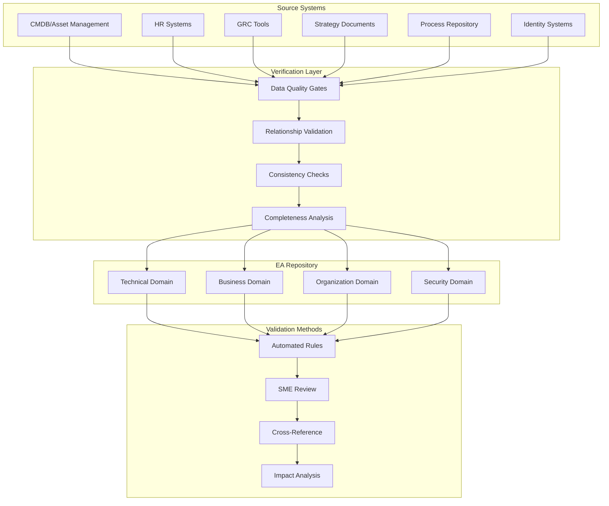

# Enterprise Architecture Population Guide

## Overview
This guide outlines the approach for populating and verifying an Enterprise Architecture (EA) repository based on the established metamodel. The focus is on ensuring data quality, completeness, and consistency across all architectural elements.

## Data Flow and Verification Points

## Population Strategy

### 1. Initial Data Load
- Extract data from authoritative sources
- Transform according to EA metamodel
- Load into staging area for validation
- Verify data quality and completeness

### 2. Incremental Updates
- Monitor source systems for changes
- Apply delta updates to repository
- Maintain change history and versioning
- Track data lineage and provenance

### 3. Relationship Building
- Establish cross-domain relationships
- Validate relationship constraints
- Ensure referential integrity
- Document relationship rationale

## Verification Methods

### 1. Automated Validation
- Data format and type checking
- Mandatory field verification
- Relationship constraint validation
- Business rule compliance

### 2. Manual Review
- Subject Matter Expert (SME) validation
- Cross-functional review sessions
- Architecture board approval
- Stakeholder sign-off

### 3. Quality Metrics
- Completeness scores
- Consistency ratings
- Relationship coverage
- Update frequency

## Continuous Improvement

### 1. Regular Audits
- Scheduled data quality reviews
- Gap analysis and remediation
- Source system alignment
- Metadata accuracy checks

### 2. Process Refinement
- Update validation rules
- Enhance data quality gates
- Improve automation coverage
- Optimize update frequency

## Best Practices

1. **Source Truth**: Maintain clear mapping to authoritative sources
2. **Version Control**: Track all changes and maintain history
3. **Quality Gates**: Implement multi-stage validation
4. **Documentation**: Maintain detailed metadata and lineage
5. **Governance**: Establish clear roles and responsibilities

## Key Success Factors

1. **Automated Integration**: Minimize manual data entry
2. **Validation Rules**: Implement comprehensive checks
3. **Stakeholder Engagement**: Ensure broad participation
4. **Change Management**: Control repository evolution
5. **Quality Metrics**: Monitor and improve data quality