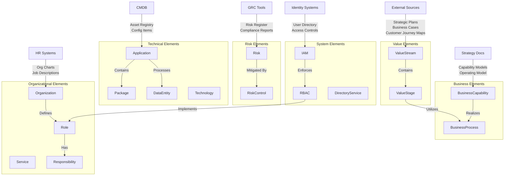

# Enterprise Architecture Population Playbook

## Architecture Overview

## Population Playbook

### 1. Value Stream Layer
**Source Systems**: Strategic Plans, Business Cases, Customer Journey Maps
- Begin with identifying core [Value Stream](ea-glossary.md#value-stream) from strategic documentation
- Break down each value stream into discrete [Value Stage](ea-glossary.md#value-stage)
- Document [inputs](ea-glossary.md#inputs) and [outputs](ea-glossary.md#outputs), and metrics for each stage
- Ensure value streams align with strategic objectives

**Example Elements**:
- [Value Stream](ea-glossary.md#value-stream): Customer Onboarding, Product Delivery, Service Fulfillment
- [Value Stage](ea-glossary.md#value-stage): Application Submission, Verification, Approval, Setup

### 2. Business Layer
**Source Systems**: Strategy Documents, Operating Model, Capability Framework
- Document [Business Capability](ea-glossary.md#business-capability) from strategy documents
- Map capabilities to relevant value streams
- Identify and document [Business Process](ea-glossary.md#business-process) that realize capabilities
- Create clear relationships between processes and value stages

**Example Elements**:
- [Business Capability](ea-glossary.md#business-capability): Payment Processing, Risk Assessment, Customer Service
- [Business Process](ea-glossary.md#business-process): Account Opening, Credit Evaluation, Service Activation

### 3. Technical Layer
**Source Systems**: CMDB, Application Portfolio
- Extract [Application](ea-glossary.md#application) inventory from CMDB
- For each application:
  - Document contained [Package](ea-glossary.md#package)
  - Map [Data Entity](ea-glossary.md#data-entity) processed
  - Identify supporting [Technology](ea-glossary.md#technology)
  - Link to supported business processes
- Document [integrations](ea-glossary.md#integrations) points and [dependencies](ea-glossary.md#dependencies)

**Example Elements**:
- [Application](ea-glossary.md#application): CRM System, Payment Gateway, Document Management System
- [Data Entity](ea-glossary.md#data-entity): Customer Profile, Transaction Record, Product Catalog
- [Technology](ea-glossary.md#technology): Database Systems, Integration Platforms, Cloud Services

### 4. Organizational Layer
**Source Systems**: HR Systems, Service Catalog
- Import [Organization](ea-glossary.md#organization) structure
- Document [Service](ea-glossary.md#service) offerings
- Define business and technical [Role](ea-glossary.md#role)
- Map [Responsibility](ea-glossary.md#responsibility) to roles
- Link services to providing organizations

**Example Elements**:
- [Organization](ea-glossary.md#organization): IT Operations, Customer Service, Risk Management
- [Role](ea-glossary.md#role): System Administrator, Business Analyst, Risk Officer
- [Service](ea-glossary.md#service): Application Support, Infrastructure Management, Help Desk

### 5. Risk and Control Framework
**Source Systems**: GRC Tools, Risk Register
- Import [Risk](ea-glossary.md#risk) register
- Document [Risk Control](ea-glossary.md#risk-control) framework
- Map controls to:
  - Business processes
  - Applications
  - Organizational responsibilities
- Ensure completeness of control coverage

**Example Elements**:
- [Risk](ea-glossary.md#risk): Data Privacy, System Availability, Regulatory Compliance
- [Risk Control](ea-glossary.md#risk-control): Access Management, Change Control, Monitoring Procedures

### 6. Access Management Layer
**Source Systems**: Identity Management Systems, Directory Services
- Document [IAM](ea-glossary.md#iam-identity-and-access-management) architecture
- Map [RBAC](ea-glossary.md#rbac-role-based-access-control) policies to organizational roles
- Link [Directory Service](ea-glossary.md#directory-service) to IAM implementation
- Validate access rights against responsibilities

**Example Elements**:
- [IAM](ea-glossary.md#iam-identity-and-access-management) Components: Identity Store, Access Control, Authentication Services
- [RBAC](ea-glossary.md#rbac-role-based-access-control) Policies: Role Definitions, Permission Sets, Access Rules

## Critical Success Factors

### Documentation Standards
- Maintain consistent [naming](ea-glossary.md#naming) conventions
- Document clear relationships and dependencies
- Keep source system references
- [version control](ea-glossary.md#version-control) all artifacts

### Governance
- Regular [stakeholders](ea-glossary.md#stakeholders) validation
- Change management process
- Periodic review and updates
- Quality assurance checks

### Implementation Approach
- Start with high-priority value streams
- Implement in [stages](ea-glossary.md#stages)
- Regular validation points
- Continuous improvement cycle

## Maintenance Guidelines

### Regular Updates
- Schedule periodic reviews
- Monitor for organizational changes
- Update technical components
- Refresh risk assessments

### Quality Control
- Validate relationships
- Check for completeness
- Ensure accuracy
- Maintain traceability

### Stakeholder Management
- Regular communications
- Feedback collection
- Training and support
- Change notification