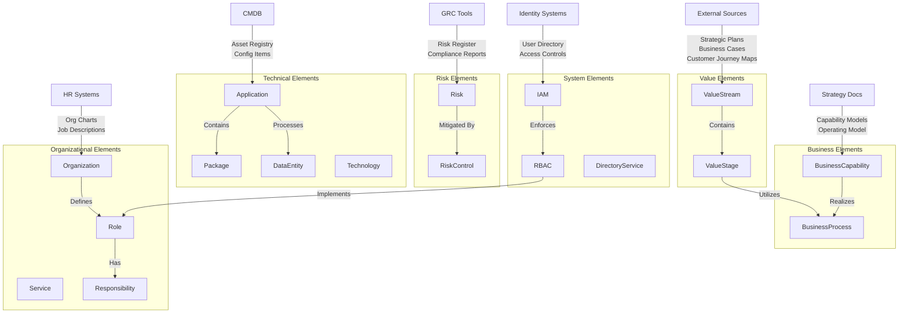

# Enterprise Architecture Population Playbook

## Architecture Overview

## Population Playbook

### 1. Value Stream Layer
**Source Systems**: Strategic Plans, Business Cases, Customer Journey Maps
- Begin with identifying core value streams from strategic documentation
- Break down each value stream into discrete stages
- Document inputs, outputs, and KPIs for each stage
- Ensure value streams align with strategic objectives

**Example Elements**:
- Value Stream: Customer Onboarding, Product Delivery, Service Fulfillment
- Value Stages: Application Submission, Verification, Approval, Setup

### 2. Business Layer
**Source Systems**: Strategy Documents, Operating Model, Capability Framework
- Document business capabilities from strategy documents
- Map capabilities to relevant value streams
- Identify and document business processes that realize capabilities
- Create clear relationships between processes and value stages

**Example Elements**:
- Business Capabilities: Payment Processing, Risk Assessment, Customer Service
- Business Processes: Account Opening, Credit Evaluation, Service Activation

### 3. Technical Layer
**Source Systems**: CMDB, Application Portfolio
- Extract application inventory from CMDB
- For each application:
  - Document contained packages/modules
  - Map data entities processed
  - Identify supporting technologies
  - Link to supported business processes
- Document integration points and dependencies

**Example Elements**:
- Applications: CRM System, Payment Gateway, Document Management System
- Data Entities: Customer Profile, Transaction Record, Product Catalog
- Technologies: Database Systems, Integration Platforms, Cloud Services

### 4. Organizational Layer
**Source Systems**: HR Systems, Service Catalog
- Import organizational structure
- Document service offerings
- Define business and technical roles
- Map responsibilities to roles
- Link services to providing organizations

**Example Elements**:
- Organizations: IT Operations, Customer Service, Risk Management
- Roles: System Administrator, Business Analyst, Risk Officer
- Services: Application Support, Infrastructure Management, Help Desk

### 5. Risk and Control Framework
**Source Systems**: GRC Tools, Risk Register
- Import risk register
- Document control framework
- Map controls to:
  - Business processes
  - Applications
  - Organizational responsibilities
- Ensure completeness of control coverage

**Example Elements**:
- Risks: Data Privacy, System Availability, Regulatory Compliance
- Controls: Access Management, Change Control, Monitoring Procedures

### 6. Access Management Layer
**Source Systems**: Identity Management Systems, Directory Services
- Document IAM architecture
- Map RBAC policies to organizational roles
- Link directory services to IAM implementation
- Validate access rights against responsibilities

**Example Elements**:
- IAM Components: Identity Store, Access Control, Authentication Services
- RBAC Policies: Role Definitions, Permission Sets, Access Rules

## Critical Success Factors

### Documentation Standards
- Maintain consistent naming conventions
- Document clear relationships and dependencies
- Keep source system references
- Version control all artifacts

### Governance
- Regular stakeholder validation
- Change management process
- Periodic review and updates
- Quality assurance checks

### Implementation Approach
- Start with high-priority value streams
- Implement in phases
- Regular validation points
- Continuous improvement cycle

## Maintenance Guidelines

### Regular Updates
- Schedule periodic reviews
- Monitor for organizational changes
- Update technical components
- Refresh risk assessments

### Quality Control
- Validate relationships
- Check for completeness
- Ensure accuracy
- Maintain traceability

### Stakeholder Management
- Regular communications
- Feedback collection
- Training and support
- Change notification